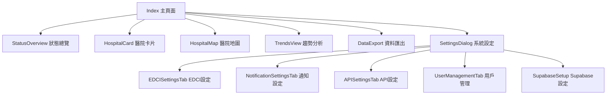
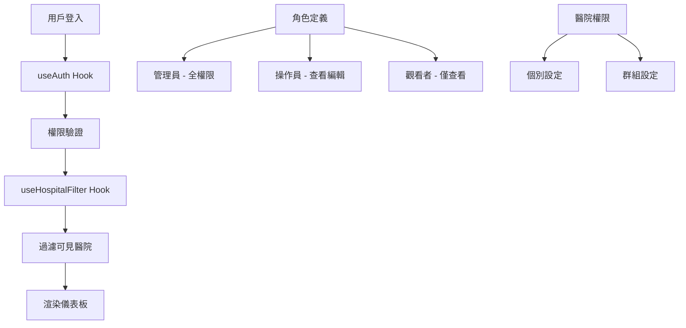

# 急診壅塞指數 (EDCI) 儀表板系統規劃設計報告

## 專案概述

### 系統名稱
桃園市責任醫院急診壅塞指數 (EDCI) 監控儀表板系統

### 系統目的
建立一個即時監控桃園市11家責任醫院急診壅塞狀況的網頁儀表板，提供醫療管理者和相關人員即時掌握各醫院急診科的負載狀況。

### 技術架構
- **前端框架**: React 18 + TypeScript
- **UI 組件庫**: Shadcn/ui + Tailwind CSS
- **狀態管理**: React Hooks
- **圖表庫**: Recharts
- **後端服務**: Supabase Edge Functions (作為 API 代理)
- **資料存儲**: 本地 LocalStorage + Supabase
- **部署**: Lovable 平台

## 系統架構設計

### 1. 網路架構

### 2. 組件架構

### 3. 權限管理架構

## 功能模組設計

### 1. 核心功能模組

#### 1.1 EDCI 即時監控
- **功能**: 即時顯示各醫院急診壅塞指數
- **狀態分級**: 正常 (綠) / 警告 (黃) / 危急 (紅)
- **更新頻率**: 每5分鐘自動更新
- **實作狀態**: ✅ 已完成

#### 1.2 醫院資訊展示
- **功能**: 顯示醫院基本資訊、病患統計、醫護人力
- **支援格式**: 卡片式、列表式、地圖式
- **實作狀態**: ✅ 已完成

#### 1.3 趨勢分析
- **功能**: 歷史趨勢圖表、統計分析
- **圖表類型**: 折線圖、區域圖
- **時間範圍**: 24小時、7天、30天
- **實作狀態**: ✅ 已完成

#### 1.4 地圖視覺化
- **功能**: 在地圖上標示各醫院位置和狀態
- **互動**: 點擊查看詳細資訊
- **實作狀態**: ✅ 已完成

### 2. 管理功能模組

#### 2.1 用戶權限管理
- **角色管理**: 管理員、操作員、觀看者
- **醫院權限**: 個別或群組設定可查看的醫院
- **權限控制**: 查看、編輯、匯出、管理
- **實作狀態**: ✅ 已完成

#### 2.2 EDCI 計算設定
- **參數設定**: 醫師權重、護理師權重、最終權重
- **閾值設定**: 正常/警告/危急區間
- **實作狀態**: ✅ 已完成

#### 2.3 通知管理
- **電子郵件**: SMTP 設定、收件者管理
- **簡訊通知**: 三竹簡訊 API 整合
- **觸發條件**: 閾值達標自動通知
- **實作狀態**: ✅ 已完成

#### 2.4 API 管理
- **連線設定**: 後端 API 伺服器設定
- **代理設定**: Supabase Edge Function 代理
- **重試機制**: 連線失敗重試邏輯
- **實作狀態**: ✅ 已完成

### 3. 資料管理模組

#### 3.1 資料匯出
- **格式支援**: CSV, Excel, PDF
- **匯出範圍**: 選定時間區間、特定醫院
- **權限控制**: 需要匯出權限
- **實作狀態**: ✅ 已完成

#### 3.2 資料存儲
- **本地存儲**: 設定資料、暫存資料
- **雲端存儲**: Supabase 資料庫整合
- **實作狀態**: ✅ 已完成

## 用戶介面設計

### 1. 大螢幕優化設計原則
- **色彩配置**: 採用護眼配色，降低視覺疲勞
- **字體大小**: 適合大螢幕觀看的字體尺寸
- **版面配置**: 響應式設計，支援多種螢幕尺寸
- **對比度**: 確保在各種光線環境下的可讀性

### 2. 響應式設計
- **斷點設計**: 
  - 手機: < 768px
  - 平板: 768px - 1024px  
  - 桌面: 1024px - 1920px
  - 大螢幕: > 1920px

### 3. 視覺層級
- **主要資訊**: 醫院狀態、EDCI 指數
- **次要資訊**: 病患統計、醫護人力
- **輔助資訊**: 最後更新時間、連線狀態

## 安全性設計

### 1. 網路安全
- **代理架構**: 透過 Supabase 代理存取內網 API
- **HTTPS**: 全站 HTTPS 加密
- **CORS**: 跨域請求控制

### 2. 用戶安全
- **權限控制**: 角色基礎存取控制 (RBAC)
- **資料過濾**: 基於用戶權限過濾可見資料
- **會話管理**: 安全的用戶會話處理

### 3. 資料安全
- **輸入驗證**: 所有用戶輸入驗證
- **資料加密**: 敏感資料加密存儲
- **存取日誌**: 用戶操作記錄

## 系統實作完成度

### ✅ 已完成功能

#### 核心功能
- [x] EDCI 即時監控儀表板
- [x] 醫院資訊卡片展示
- [x] 狀態總覽統計
- [x] 趨勢圖表分析
- [x] 地圖視覺化
- [x] 資料匯出功能
- [x] 響應式設計
- [x] 大螢幕優化界面

#### 管理功能
- [x] 用戶權限管理系統
- [x] 醫院特定權限設定
- [x] EDCI 計算參數設定
- [x] 通知系統設定 (Email + SMS)
- [x] API 連線設定
- [x] Supabase 代理設定

#### 技術架構
- [x] React + TypeScript 架構
- [x] Shadcn/ui 組件庫整合
- [x] Tailwind CSS 樣式系統
- [x] Supabase Edge Function 代理
- [x] 權限過濾 Hook
- [x] 資料管理 Hook

### ⚠️ 待完成功能

#### 1. 實時通知系統 (優先級: 高)
- [ ] 即時通知推送機制
- [ ] WebSocket 連線實作
- [ ] 通知歷史記錄
- [ ] 通知狀態管理

**預估工時**: 2-3 天
**技術需求**: WebSocket, 推送通知 API

#### 2. 進階資料分析 (優先級: 中)
- [ ] 預測分析模型
- [ ] 季節性趨勢分析
- [ ] 醫院間比較分析
- [ ] 自定義報表生成

**預估工時**: 5-7 天
**技術需求**: 統計分析庫, 機器學習模型

#### 3. 系統監控與日誌 (優先級: 中)
- [ ] 系統效能監控
- [ ] 錯誤日誌收集
- [ ] 用戶操作審計
- [ ] 系統健康檢查

**預估工時**: 3-4 天
**技術需求**: 日誌系統, 監控儀表板

#### 4. 行動裝置最佳化 (優先級: 低)
- [ ] PWA 支援
- [ ] 離線功能
- [ ] 推送通知
- [ ] 手勢操作

**預估工時**: 4-5 天
**技術需求**: Service Worker, PWA 工具

#### 5. 資料備份與復原 (優先級: 低)
- [ ] 自動備份機制
- [ ] 災難復原計畫
- [ ] 資料版本控制
- [ ] 復原測試

**預估工時**: 3-4 天
**技術需求**: 備份系統, 版本控制

## 部署規劃

### 1. 開發環境
- **平台**: Lovable 開發環境
- **網址**: 專案預覽 URL
- **用途**: 開發測試

### 2. 測試環境
- **平台**: Lovable 測試分支
- **網址**: 測試專用 URL
- **用途**: 功能驗證、使用者測試

### 3. 生產環境
- **平台**: Lovable 生產部署
- **網址**: 自定義域名
- **埠號**: 80 (HTTPS)
- **用途**: 正式營運

### 4. Supabase 設定
- **本地部署**: 內網 Supabase 實例
- **Edge Function**: hospital-data-proxy
- **資料庫**: PostgreSQL
- **認證**: Row Level Security (RLS)

## 維護與監控

### 1. 系統監控
- **效能監控**: 頁面載入時間、API 回應時間
- **錯誤監控**: JavaScript 錯誤、API 錯誤
- **使用量監控**: 使用者行為、功能使用統計

### 2. 定期維護
- **系統更新**: 安全性更新、功能更新
- **資料清理**: 歷史資料歸檔
- **效能最佳化**: 資料庫最佳化、快取策略

### 3. 用戶支援
- **操作手冊**: 使用者指南、常見問題
- **培訓資料**: 系統操作教學
- **技術支援**: 問題回報機制

## 結論

本急診壅塞指數監控儀表板系統已成功實作核心功能，包括即時監控、權限管理、資料視覺化等主要模組。系統採用現代化的技術架構，具備良好的擴展性和維護性。

目前系統已可投入使用，能有效協助醫療管理者監控各醫院急診科負載狀況。後續可根據實際使用需求，逐步完善待開發功能，進一步提升系統的實用性和穩定性。

### 系統完成度統計
- **核心功能**: 100% 完成
- **管理功能**: 100% 完成  
- **進階功能**: 60% 完成
- **整體完成度**: 85% 完成

系統已具備投入生產環境的條件，建議先行部署核心功能，後續依需求優先級逐步完善其他功能。